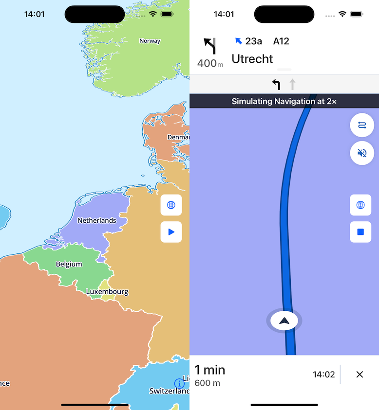

[](https://maplibre.org)

The Maplibre Navigation SDK for iOS is built on a fork of the [Mapbox Navigation SDK v0.21](https://github.com/maplibre/maplibre-navigation-ios/tree/v0.21.0) which is build on top of the [Mapbox Directions API](https://www.mapbox.com/directions) (v0.23.0) and contains logic needed to get timed navigation instructions.

With this SDK you can implement turn by turn navigation in your own iOS app while hosting your own Map tiles and Directions API.

# Why have we forked

1. Mapbox decided to put a closed source component to their navigation SDK and introduced a non open source license. Maplibre wants an open source solution.
2. Mapbox decided to put telemetry in their SDK. We couldn't turn this off without adjusting the source.
3. We want to use the SDK without paying Mapbox for each MAU and without Mapbox API keys.

All issues are covered with this SDK. 

# What have we changed

- Removed EventManager and all its references, this manager collected telemetry data which we don't want to send
- Transitioned from the [Mapbox SDK](https://github.com/mapbox/mapbox-gl-native-ios) (version 4.3) to [Maplibre Maps SDK](https://github.com/maplibre/maplibre-gl-native) (version 6.0.0)
- Added optional config parameter in NavigationMapView constructor to customize certain properties like route line color

# Migrating from v2 to v3

MaplibreNavigation v3 allows you to start a navigation in an existing Map, so no modal ViewController needs to be presented over an existing map as before. This results in some breaking changes. 

### Step 1:

Replace your ViewController that hosts the mapView with a `NavigationViewController`. We suggest to create a subclass of `NavigationViewController` and override init & call `super.init(dayStyle:)` or `super.init(dayStyleURL:)`. With v3, NavigationViewController will not start navigation until you request it.

### Step 2:

Start the navigation by calling `startNavigation(with: route)`. If you want to simulate your route, you need to pass in the optional locationManager parameter, otherwise the real location of the device will be used.

```swift
#if targetEnvironment(simulator) 
    let locationManager = SimulatedLocationManager(route: route)
    locationManager.speedMultiplier = 2
    self.startNavigation(with: route, locationManager: locationManager)
#else
    self.startNavigation(with: route)
#endif
```

### Step 3:

Make your ViewController conform to `NavigationViewControllerDelegate` and implement `navigationViewControllerDidFinishRouting(_ navigationViewController: NavigationViewController)` to transition back to normal map mode. This delegate is called when the user arrives at the destination or cancels the navigation.

```swift
extension SceneDelegate: NavigationViewControllerDelegate {
    func navigationViewControllerDidFinishRouting(_ navigationViewController: NavigationViewController) {
        navigationViewController.endNavigation()
    }
}
```

### Backwards compatibility

If for some reason, you want to keep the old way of presenting a navigation modally, you can still do that. Simply call `startNavigation(with: route)` right after creating the `NavigationViewController`.


# Getting Started

If you are looking to include this inside your project, you have to follow the the following steps:

Install this package using the [Swift Package Manager](https://www.swift.org/documentation/package-manager/).

1. Open your project in Xcode.
1. -> File -> Add Package Dependencies
1. Enter the URL of this repository into the search field: https://github.com/maplibre/maplibre-navigation-ios
  1. Press "Add Package".
  1. In the modal, update "Add to Target" to include your application.
  1. Complete the installation by pressing "Add Package".
1. Add properties to `Info.plist`
   - MGLMapboxAccessToken / String / Leave empty = Ensures that the SDK doesn't crash
   - MGLMapboxAPIBaseURL / String / Add url = Url that is being used to GET the navigation JSON
   - NSLocationWhenInUseUsageDescription / String / Add a description = Needed for the location permission
1. [optional] When app is running on device and you're having problems: Add `arm64` to `PROJECT -> <Project naam> -> Build Settings -> Excluded Architecture Only`
1. Use the sample code as inspiration

# Getting Help

- **Have a bug to report?** [Open an issue](https://github.com/maplibre/maplibre-navigation-ios/issues). If possible, include the version of Maplibre Services, a full log, and a project that shows the issue.
- **Have a feature request?** [Open an issue](https://github.com/maplibre/maplibre-navigation-ios/issues/new). Tell us what the feature should do and why you want the feature.

## Sample code

We do provide a limited example app but its not functional right out of the box. 

1. Open Secrets.xcconfig and add a mapbox api token. This is needed to obtain a route. A free mapbox account is enough for evaluation.
2. You need a maptile source. The example uses a demo source which only displays country borders.
3. Tap the play button to start a navigation

[](https://maplibre.org)

## Community

Join the #maplibre-native Slack channel at OSMUS: get an invite at https://slack.openstreetmap.us/
Read the [CONTRIBUTING.md](CONTRIBUTING.md) guide in order to get familiar with how we do things around here.

# License

Code is [licensed](LICENSE.md) under MIT and ISC. 
ISC is meant to be functionally equivalent to the MIT license.

Copyright (c) 2022 MapLibre contributors
®®®